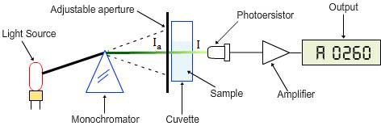
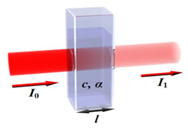
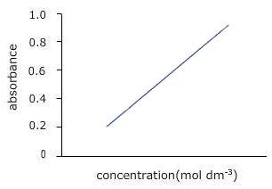
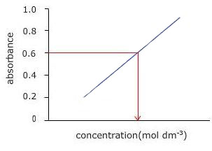

## Theory

 A spectrophotometer is a photometer that can measure the intensity of light as a function of its wavelength. Single beam and double beam are the two major classes of spectrophotometers. Linear range of absorption and spectral bandwidth measurement are the important features of spectrophotometers.

In Single Beam Spectrophotometers, all the light passes through the sample. To measure the intensity of the incident light the sample must be removed so that all the light can pass through. This type of spectrometer is usually less expensive and less complicated. The single beam instruments are optically simpler and more compact, znc can also have a larger dynamic range.

In a Double Beam Spectrophotometer, before it reaches the sample, the light source is split into two separate beams. One beam passes through the sample and the  second one is used for reference. This gives an advantage because the reference reading and sample reading can take place at the same time.
 
In transmission measurements, the spectrophotometer quantitatively compares the amount of light passing through the reference and test sample. For reflectance, it compares the amount of light reflecting from the test and reference sample solutions.
 
Many spectrophotometers must be calibrated before they start to analyse the sample and the procedure for calibrating spectrophotometer is known as "zeroing." Calibration is done by using the reference substance, and the absorbencies of all other substances are measured relative to the reference substance. % transmissivity (the amount of light transmitted through the substance relative to the initial substance) is displayed on the spectrophotometer.
 

 

The major sequence of events in spectrophotometry is as follows:

 

The light source shines through a monochromator.
 An output wavelength is selected and beamed at the sample.
 A fraction of the monochromatic light is transmitted through the sample and to the photo-detector.
 
### Single Beam Spectrophotometer:

Spectrophotometry deals with visible light, near UV and near IR. To acquire the spectral information quicker in IR spectrophotometers, which use a Fourier transform technique and is called Fourier Transform Infrared (FTIR).

### Different Types of Spectrophotometers: 
**A. Single Beam**:  In this type, all the light passes through the sample .To measure the intensity of the incident light the sample must be removed so that all the light can pass through. This type of spectrometer is usually less expensive and less complicated.

 
**B. Double Beam**: In this type, before it reaches the sample, the light source is split into two separate beams. From these one passes through the sample and second one is used for reference. This gives an advantage because the reference reading and sample reading can take place at the same time.
 
**C. Visible Ligh**t (400-700 nm): Visible spectrophotometers can use incandescent, halogen, LED, or a combination of these sources and these spectrophotometers vary in accuracy. Plastic and glass  cuvettes  can  be used for visible light spectroscopy.
 
 
**D. Ultraviolet Light**: UV spectroscopy is used for fluids, and even solids. Cuvettes, only made of quartz, are used for placing the samples.
 
**E. Infrared Light**: IR spectroscopy helps to study different structures of molecules and their vibrations. Different chemical structures vibrate in different ways due to variation of energy associated with each wave length. For example, mid-range and near infrared (higher energy) infrared tends to cause rotational vibrations and harmonic vibrations respectively.

### Beer-Lamberts Law:

Diagram of Beer-Lambert absorption of a beam of light as it travels through a cuvette of width $l$

Beer-Lambert's law is the linear relationship between the absorbance and concentration of the absorbing sample, i.e. a logarithmic relation exist between the transmission of light through a substance ( $T$ ) and the product of absorption coefficient of a substance ( $\alpha$ ) and  distance travelled by the light through the material (path length $l$ ) The absorption coefficient is the product of molar absorptivity, the concentration the material, or an absorption cross section, $\sigma$ and the (number) density,

Where,
$\varepsilon$ is the molar absorptivity of the absorber,
$C$ is the concentration of the absorbing species in the material and
$N$ is the density (number) of adsorbers.

For liquids, these relations are usually written as:

$$T=\frac{I}{I_0}=10^{-al}=10^{-\varepsilon l c}$$

Whereas for gases, these relations are written as:

$$T=\frac{I}{I_0}=e^{-\alpha' T}=e^{-\sigma l N}$$

where,

$I_0$ intensity of the incident light  
$I$ intensity of the transmitted light  
$\sigma$ cross section of light absorption by a single particle  
$N$ density of absorbing particles  

The transmission (or transmissivity) for liquids in terms of absorbance, is defined as:

$$A=-log_{10}(I/I_0)$$

The relationship between absorbance ( $A$ ) and percent transmittance ( $\%T$ ) is also quantitative and this can be written as:

$A=-log($ % $T/100)$

Percent transmittance is $\frac{I}{I_0}\times 100$

Whereas, for gases, it is usually defined as:

$$A'=-ln \left( \frac{I}{I_0} \right)$$

The above equation shows that the absorbance becomes linear relationship with the concentration according to:

$$A = \varepsilon lc=\alpha l$$

and

$$A' = \sigma lN=\alpha' l$$

Thus, the absorbance is measured, if the path length and the molar absorptivity are known and the concentration of the substance can be deduced.
 
According to the Beer-Lambert Law, absorbance is proportional to concentration, so that at dilute solutions a plot of concentration vs. absorbance would be straight line, but the Law breaks down for solutions of higher concentration, and so you might get a curve under those circumstances.

### Applications of a Spectrophotometer:
 

1. It is directly used to measure light intensity at different wavelengths.
2. It is used to determine the unknown concentration of solution.
3. Spectrometers can be used to determine the equilibrium constant of a reaction involving ions.

